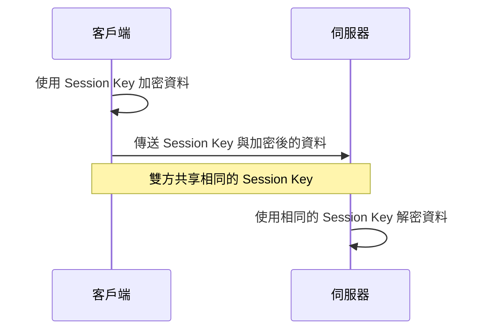
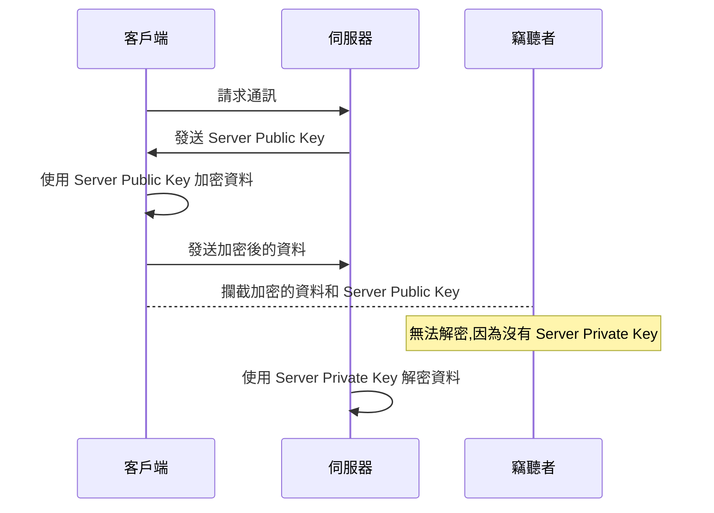
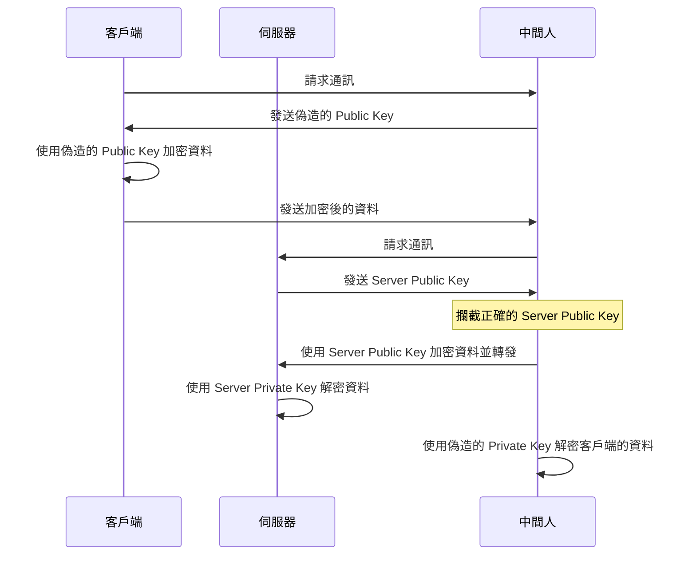
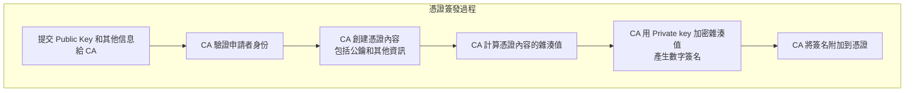
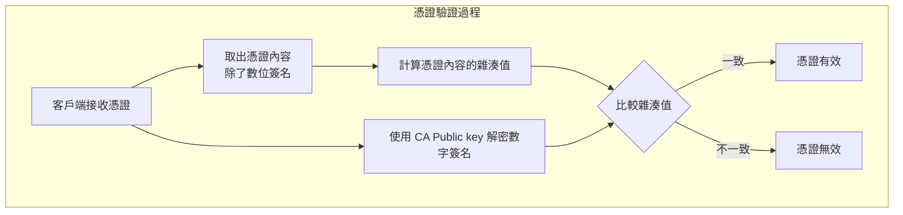
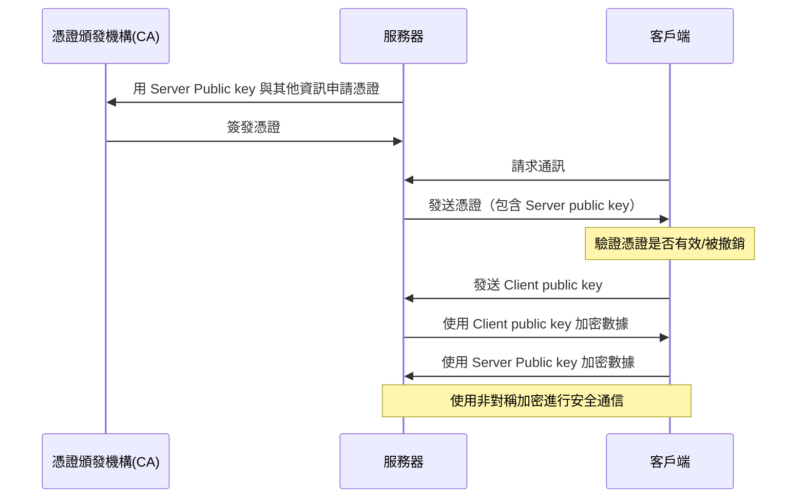
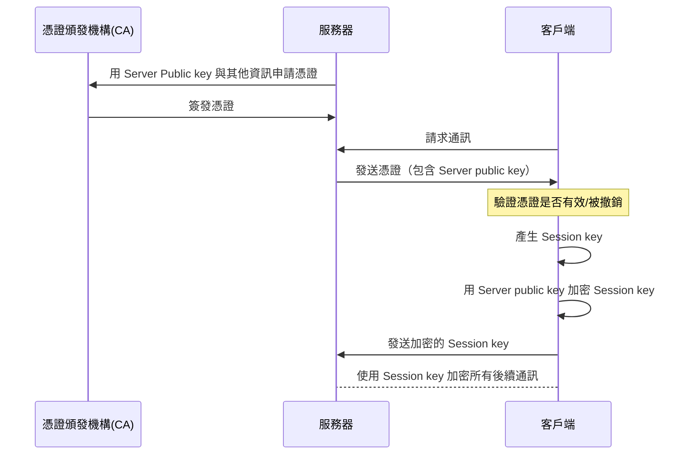
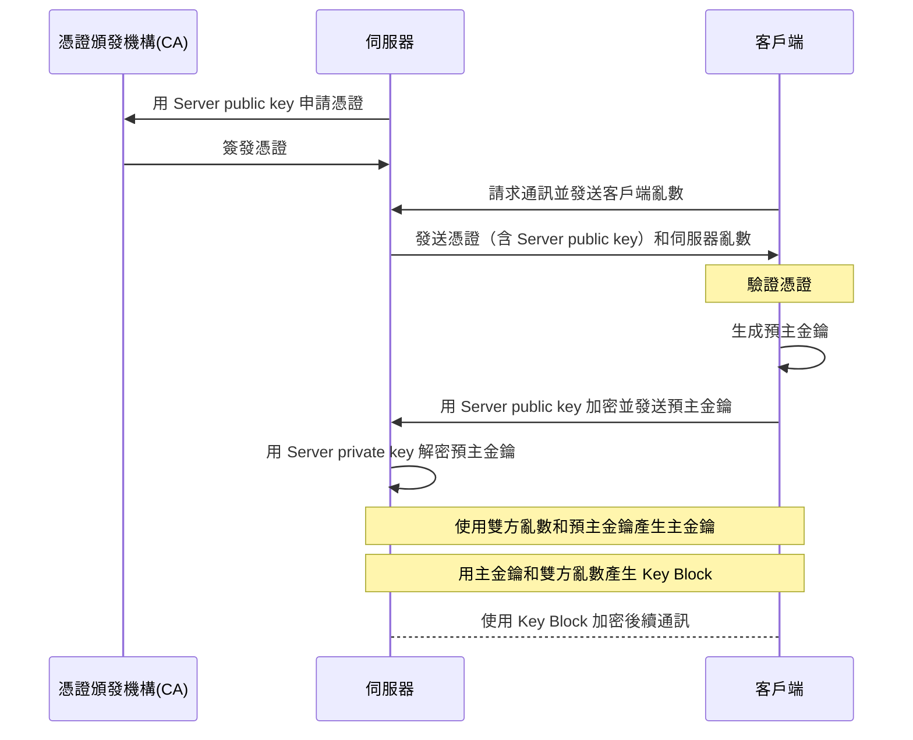

## 資料傳輸

當我們在網站使用 HTTP 傳資料給伺服器時，都是使用明碼傳輸，並不會進行任何加密。這就很有可能被竊聽者從中擷取資料。

那對資料加密不就好了嗎？

## 對稱加密

是的，我們需要對資料加密。
當我們對資料進行加密，勢必需要一把鑰匙，這把鑰匙通常被稱為 Session Key，
使用 Session Key 對資料加密再傳給伺服器，伺服器再用這把 Session Key 解密，這個加密方式叫做**對稱加密**。

什麼是 Session Key？引用 [what-is-a-session-key](https://www.cloudflare.com/zh-tw/learning/ssl/what-is-a-session-key/) 的內容

> 工作階段金鑰是用於僅對單次通訊工作階段（註：工作階段可能是一段時間或是一次對話）進行加密的任何對稱密碼編譯金鑰。換句話說，它是一個臨時金鑰，只使用一次，僅在一個時間段內用於加密和解密雙方之間傳送的資料；雙方之間的未來對話將使用不同的工作階段金鑰進行加密。工作階段金鑰就像每次登入時都會重設的密碼一樣。

在 TLS 中 Session Key 不會是由客戶端獨自產生，這個在後續章節會提到。

But，問題還是存在。
我們加密了資料，那誰來加密 Session Key 呢？不斷地加密下去儼然會變成無限輪迴，這時候就要使用**非對稱加密**。

## 非對稱加密

非對稱加密會有兩把鑰匙，一把是 Public Key，另一把是 Private Key，就像它們的名字一樣，一把是公開，一把是私密的。

Public Key 和 Private Key 其中一把是用來加密，另一把用來解密。但要注意的是沒有限定哪一把是用來加密的，不同的情況下可能不同。

讓我們用非對稱加密再重來一次。

當客戶端想要傳資料給伺服器時，客戶端會先跟伺服器知會一聲，伺服器就會將 Public Key 傳給客戶端，此時客戶端用 Public Key 將資料加密再傳給伺服器，伺服器就可以用 Private Key 解密資料。就算竊聽者獲得了加密後的資料與 Public Key，但因為沒有 Private Key 也解不開資料。

RSA 是常見的非對稱加密方式，對算法有興趣的話可以看[李永樂老師11分鐘講RSA加密算法](https://www.youtube.com/watch?v=D_kMadCtKp8&t=2s)。

But，有可能有中間人會偽造 Public Key 和 Private Key阿。

中間人將偽造的 Public Key 傳給客戶端，客戶端用這把偽造的 Public Key 對資料進行加密，中間人再次將加密的資料擷取下來並用自己的 Private Key 解密，所以...資料又再次被偷走了。

這裡的問題發生在客戶端無法得知這個 Public Key 是由誰所產生的，大家都有可能產生 Public Key ，所以我們需要對 Public Key 做簽名（實際上會將 Public Key 放到憑證內再對憑證做簽名），以證明這把 Public Key 是由正確的 Server 發出。

## 憑證 Certificate

要誰來簽名呢？自己簽不是不行，實際確實也有這種做法（Self-Sign），但自己簽名是不具備任何效力的，中間人也可以自己簽名，所以必須有可信任的第三方來簽名也就是憑證認證機構 (CA)。
這邊所謂的「簽名」其實就是對憑證做非對稱加密。要了解為什麼簽名可以證明合法性，我們要先來了解憑證與簽名做了什麼。

憑證內容主要包含幾個部分：

- 伺服器的公鑰
- 憑證頒發機構
- 憑證要發給誰
- 有效期限
- 數位簽名（將其他資訊雜湊再加密的結果）

#### 簽名憑證：

1. 首先將憑證的內容（除了數位簽名）通過雜湊函數 (Hash Function) 產生一個固定長度的雜湊值，這可以用來檢查憑證內容是否被人攥改。
2. CA 使用 CA Private key 對這個雜湊值進行加密，產生數位簽名，再將簽名放到憑證中。

你可能會想說 CA public key 是公開的，那再加密雜湊值有意義嗎？其實加密並不是主要目的，而是驗證簽名的來源，因為可信任的 CA public key 清單裡不會有不被信任的 CA public key（瀏覽器或作業系統會維護這個清單）。
換言之，這個加密的雜湊值若不是由可信任的 CA Private key 所加密，因為可信任的 CA public key 清單內沒有對應的 Public key，所以就解不開了。

#### 驗證憑證：

驗證之前通常瀏覽器或作業系統會自動更新 CA 的 Public key。

1. 客戶端使用 CA 的 Public key 解密數位簽名，得到簽名時的雜湊值。
2. 客戶端將憑證內容（除了數位簽名）產生出雜湊值（這個步驟跟上面 CA 做的是一樣的）。
   將這兩個雜湊值進行比對。如果兩者一樣，則證明憑證內容未被篡改，且確實由 CA 簽發，因為只有 CA 才能使用對應的私鑰產生簽名。

因為雜湊函數是任何長度的內容，產生出固定長度的雜湊值，所以還是有機率會產生一樣的雜湊值，也就是「碰撞」。
就像一個班級裡面人數夠多，發生生日碰撞的機率也會很高，這個有趣的數學問題可以參考[李永樂老師講解生日碰撞和哈希函數](https://www.youtube.com/watch?v=uS1ZIAsvT5w)。

知道了憑證怎麼簽發和驗證之後，我們再順一次流程。

## 信任鏈

憑證的概念大致告一段落，但是 CA 畢竟須要頻繁的頒發憑證，也就是隨時要聯網，這也大大增加 Private key 洩漏的風險，於是就有了**信任鏈**這個東西。

信任鏈其實就是再多一個中級 CA （Intermediate CA），由根 CA（Root Certificate Authority）來為中級 CA的 Public key 簽名，本身原理是一樣的，但是因為有多層 CA 的信任結構，就算中級 CA 的 Private key 洩漏，也不會直接影響到根 CA 的安全性。

並且因為中級 CA 的機構數量本身就比較少，幫這些中級 CA 簽名的根 CA 就不必一直簽發憑證，也就是可以離線儲存根 CA 的 Private key，這樣可以大幅提升安全性。

## TLS

雖然用非對稱加密已經達成我們的目的，但後續通訊上一直使用非對稱加密實在太費效能，所以 TLS 其實會混和對稱加密與非對稱加密，用非對稱加密對稱加密的 Session key，這樣同時使用兩者的流程可以確保安全性以並兼顧效率。大致流程如下：

終於中間人竊取不到通訊的內容了，但是...中間人可以重複發請求阿。假設你的刷卡被加密了起來，雖然中間人看不到內容，但他只要截取一樣的請求，重複的發給伺服器，伺服器因為這個通訊**缺乏唯一性**是無法辨認的，這是所謂的「重播攻擊」。

為了防止這種情況，TLS 會在對話中加入序列號(Sequence Number)、時間戳(Timestamp)、隨機數(Nonce)等機制，來確保每次通訊的唯一性，讓伺服器能夠判斷並拒絕重複的請求。以下說明：

- 序列號、時間戳：可以用來判斷消息的順序或時間。
- 客戶端亂數、伺服器亂數：確保即使在相同的時間點開始的對話也會產生不同的主金鑰。
- 預主金鑰（Pre-master Secret）：由客戶端產生。
- 主金鑰（ Master Secret）：我們可以從 [RFC 5246: TLS 1.2](https://www.rfc-editor.org/rfc/rfc5246#section-8.1) 內知道主金鑰是由客戶端亂數、伺服器亂數和預主金鑰所產生，因為兩個亂數及預主金鑰已經做過交換，所以兩邊產生的主金鑰也會相同。並且為了提升安全性，在產生主金鑰之後預主金鑰就會被刪除。
- Key Block：類似 Session key。Key Block 是由客戶端亂數、伺服器亂數和主金鑰所產生，Key Block 會產生 `client_write_key`、`server_write_key`、`client_write_mac_key`、` server_write_mac_key` 四把 key，這樣
  可以有效避免攻擊者利用單一金鑰破解整個通訊過程。即使攻擊者破解了其中一個金鑰，也無法完全破解整個通訊內容。

再加上這些機制的話，流程會如下圖：

## 延伸閱讀

[HTTPS, SSL, TLS & Certificate Authority Explained](https://www.youtube.com/watch?v=EnY6fSng3Ew)