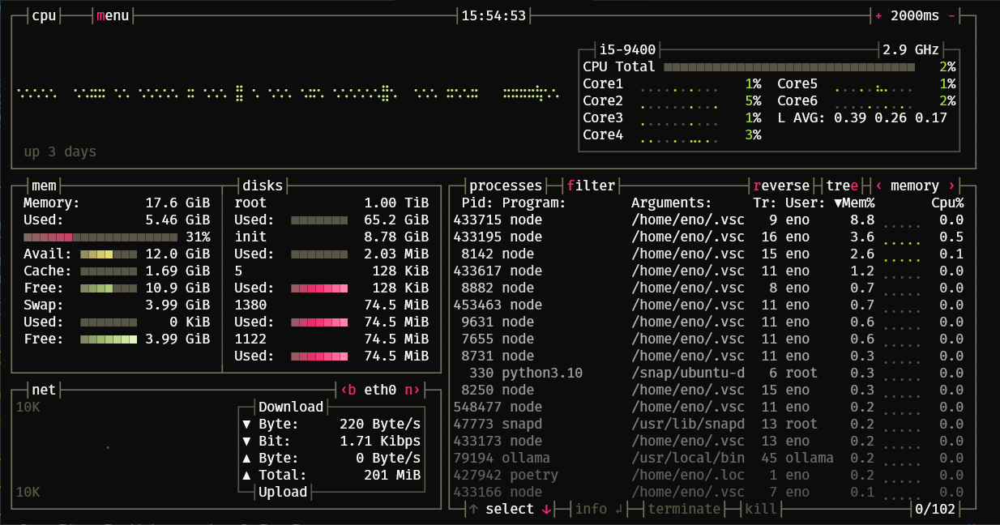
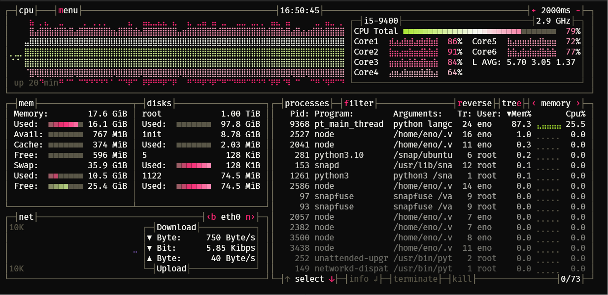

本篇文章是參考 [Chapter 15. Swap Space](https://docs.redhat.com/en/documentation/red_hat_enterprise_linux/7/html/storage_administration_guide/ch-swapspace#ch-swapspace) 的筆記。

最近在 Study LLM 的技術因為記憶體不夠的關係，一直發生 **OOM(Out of memory)** 的問題，前輩建議可以用 Swap 解決。

在 Linux 中，當實體記憶體 (RAM) 不夠用時，可以將記憶體內沒有活動的資源移至硬碟(Disk)，達到釋放出更多的記憶體空間。這個技術稱為**交換空間 Swap space**，在 Windows 稱為 Page，其實也就是**虛擬記憶體**。

當然一直使用Swap也不是長久之計，畢竟就算是SSD，速度還是比記憶體還要慢的，所以該花的錢還是要花。

## 怎麼使用 Swap

### 檢查 Swap 狀態

[Chapter 15. Swap Space](https://docs.redhat.com/en/documentation/red_hat_enterprise_linux/7/html/storage_administration_guide/ch-swapspace#ch-swapspace) 內有提到，當 Swap 正在使用時去修改它，會造成失敗。先用下面其中一個指令來檢查一下 Swap 的狀態。

```bash
free -h
swapon --show
cat /proc/swaps
```

Swap used 的部分應該要是 0，如果不是 0 的話就重開機吧。

### 建立 Swap File

1. 依照以下表格決定需要的 Swap 大小。

| 系統中的 RAM                 | 推薦的交換空間  | 如果允許休眠，建議的交換空間 |
| ---------------------------- | --------------- | ---------------------------- |
| ⩽ 2 GB                       | RAM 容量的 2 倍 | RAM 容量的 3 倍              |
| > 2 GB – 8 GB> 2 GB – 8 GB   | 等於 RAM 的容量 | RAM 容量的 2 倍              |
| > 8 GB – 64 GB> 8 GB – 64 GB | 至少 4 GB       | RAM 容量的 1.5 倍            |
| > 64 GB                      | 至少 4 GB       | 不建議休眠                   |

2. 建立一個空文件( 下面的 4G 改成你需要的大小)：

```bash
fallocate -l 4G /swapfile
```

3. 將 `/swapfile` 設定 Swapfile：

```bash
mkswap /swapfile
```

4. 設定 Swapfile 權限：

```bash
chmod 600 /swapfile
```

600 這個數字代表的是檔案或目錄的權限設置， 6、0、0 這三個數字要分別來看 ，三個數字分別指定擁有者 (User)、使用者群組 (Group)、其他使用者(Other)個別的權限。

至於數字的意義則是要用二進制來理解，6 的二進制是 110 ，1、1、0 分別代表著讀 (r)、寫 (w)、執行 (x) 的權限，所以6 表示可以讀寫但不能執行，至於0則是不能讀寫也不能執行。

所以600的意思就是**只有檔案擁有者可以讀和寫該檔案**。

5. 啟動 Swap space：

```bash
swapon /swapfile
```

6. 檢查 Swap space 是否啟動

```bash
free -h
swapon --show
cat /proc/swaps
```

若要在系統啟動時啟用 Swap space，用 root 身分在 `/etc/fstab` 裡加入這段：

```bash
/swapfile swap swap defaults 0 0
```

並重新載入`/etc/fstab` 的配置

```bash
systemctl daemon-reload
```

如果要改變 Swap 大小前，先確保 Swap 沒有在使用(如果在使用中可以重新開機)，再將 Swap 停止並刪除 `/swapfile` ：

```bash
sudo swapoff -a
sudo rm /swapfile
```

之後就重複上面創建 `/swapfile` 的步驟就好

這邊推薦一個美美的系統資源監控工具 [Bashtop](https://github.com/aristocratos/bashtop)，在下圖左方的 mem 那格的最下面可以看到目前 Swap 的使用狀況。



最後在使用 Swap 的情況下終於不會 OOM 了(灑花)，在 RAM 吃滿16G的情況下，Swap 甚至一度吃到 18G。



### 後記

後來發現在 WSL 上有個更快的方法，可以直接修改`.wslconfig`這個檔案來設定 Swap，詳細參考 [WSL 設定](https://learn.microsoft.com/zh-tw/windows/wsl/wsl-config#example-wslconfig-file)。

```
[wsl2]
...
# Sets amount of swap storage space to 8GB, default is 25% of available RAM
swap=8GB
```
